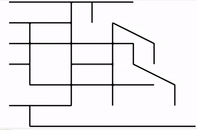

# Dynamic-Traffic-Light-Simulation
Urban traffic congestion poses a significant challenge in intelligent transportation systems, where traditional signal control strategies often struggle to respond adaptively to dynamic and spatially distributed traffic conditions. In this work, we propose a novel Multi-Agent Deep Reinforcement Learning (MARL) framework for intelligent traffic signal control across multiple intersections. Each intersection is controlled by an independent agent equipped with a hybrid architecture comprising Long Short-Term Memory (LSTM) networks to model temporal traffic patterns, Convolutional Block Attention Modules (CBAM) to emphasize spatially significant vehicles near the junction, and a Dueling Double Deep Q-Network (D3QN) to derive optimal control policies. Additionally, we incorporate a dynamic phase timing mechanism that adjusts signal durations in real time based on traffic density and flow, enhancing responsiveness and throughput. The proposed framework is evaluated using the Simulation of Urban Mobility (SUMO) platform in diverse multi-intersection urban scenarios, demonstrating improved adaptability, scalability, and efficiency in managing complex traffic networks.
 

